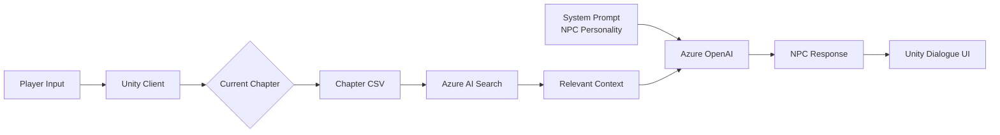

# LLM-NPC-RPG
소개 영상
시연 영상

LLM, RAG, STT/TTS를 활용하여 플레이어와 자연스럽게 대화하는 NPC를 구현한 Unity 기반 AI RPG 프로젝트입니다.

기존 게임의 정형화된 NPC 대화를 넘어, 플레이어의 질문을 이해하고 게임 세계관을 기반으로 답변하는 인터랙티브 NPC 시스템 구현을 목표로 개발했습니다.

## 목차

- 프로젝트 소개
- 프로젝트 개요
- 시스템 아키텍처
- 기술 스택
- 주요 기능
- 개발 과정
- 문제 해결
- 프로젝트 회고

---

## 프로젝트 소개

기존 게임의 NPC는 정해진 대사만 반복하거나 선택지 기반으로 대화를 진행하는 경우가 대부분입니다. 이러한 방식은 플레이어와의 상호작용이 제한적이며, 반복 플레이 시 몰입감이 떨어지는 한계가 있습니다.

본 프로젝트는 LLM(Large Language Model)을 활용하여 플레이어의 자연어 입력을 이해하고, 게임 세계관과 NPC의 역할에 맞는 답변을 생성하는 NPC 대화 시스템을 구현하는 것을 목표로 개발했습니다.

또한 RAG(Retrieval-Augmented Generation)를 적용하여 NPC가 게임 내 설정과 시나리오를 기반으로 일관성 있는 답변을 생성하도록 하였으며, STT(Speech-to-Text)와 TTS(Text-to-Speech)를 연동하여 음성 기반 상호작용까지 지원하는 인터랙티브 RPG 환경을 구현했습니다.

---

## 프로젝트 개요

| 항목      | 내용                                                             |
| ------- | -------------------------------------------------------------- |
| 프로젝트명   | LLM-NPC-RPG                                                    |
| 프로젝트 형태 | Microsoft AI School 팀 프로젝트                                     |
| 개발 기간   | 2024.08.21 ~ 2024.08.29 (9일)                                   |
| 개발 인원   | 5명                                                             |
| 역할      | Team Leader / Unity Client / LLM Integration / RAG / STT · TTS |

### 담당 역할

* 프로젝트 일정 관리 및 개발 방향 조율
* Unity 기반 게임 클라이언트 전체 개발
* Azure OpenAI REST API 연동
* Azure AI Search 기반 RAG 구축
* Azure Speech(STT/TTS) 연동
* NPC 시나리오 및 RAG 데이터 작성
* 프로젝트 발표 및 시연
  
---

## 시스템 아키텍처

Unity Client  
&emsp;&emsp;│  
&emsp;REST API  
&emsp;&emsp;│  
Azure OpenAI  
&emsp;&emsp;│  
&emsp;&emsp;├─ Azure AI Search (RAG)  
&emsp;&emsp;├─ Azure Speech STT  
&emsp;&emsp;└─ Azure Speech TTS  

---

## 기술 스택

| Category              | Technologies                                   |
| --------------------- | ---------------------------------------------- |
| **Game Client**       | Unity, C#                                      |
| **AI Platform**       | Azure OpenAI, Azure AI Search, Azure AI Speech |
| **Prototype & Tools** | Python, Gradio                                 |
| **API Integration**   | REST API (HTTP)                                |
| **Version Control**   | Git, GitHub                                    |

---

## 주요 기능

### 1. 시나리오 기반 NPC 대화 시스템
#### 배경

기존 게임의 NPC는 정해진 대사나 선택지 기반으로만 대화를 진행하기 때문에 플레이어의 다양한 자연어 입력에 대응하기 어렵습니다. 반대로 LLM만 사용할 경우 게임의 세계관과 시나리오를 벗어난 응답을 생성할 수 있습니다.

본 프로젝트는 자유로운 자연어 대화를 지원하면서도 게임의 스토리와 퀘스트 진행 흐름을 유지할 수 있는 NPC 대화 시스템을 목표로 개발했습니다.

#### 설계

LLM은 게임의 현재 진행 상황을 알지 못하기 때문에 전체 시나리오를 검색 대상으로 사용할 경우 아직 진행되지 않은 이벤트나 미래의 스토리를 답변하는 문제가 발생할 수 있었습니다.

이를 해결하기 위해 시나리오를 챕터 단위의 RAG 데이터로 분리하고, 현재 진행 중인 챕터만 검색 대상으로 제한하여 필요한 정보만 LLM에 전달하도록 설계했습니다.

#### 구현

- 챕터별 CSV 데이터를 Azure AI Search Index로 구축
- Azure AI Search 기반 RAG 검색 적용
- NPC별 System Prompt 구성
- 챕터별 CSV 시나리오 관리
- 현재 챕터만 검색 대상으로 제한
- 상황(Context), 대화 예시 및 키워드를 함께 저장하여 검색 Context 구성

#### 흐름도

#### RAG 데이터 구조

NPC의 대사와 함께 현재 진행 상황 및 시나리오 진행 순서(Page)를 저장하여,
LLM이 현재 시나리오의 맥락을 이해하고 게임 진행 흐름에 맞는 응답을 생성하도록 설계했습니다.

| 컬럼   | 설명                                 |
| ---- | ---------------------------------- |
| ID   | 대사 식별자                             |
| 등장인물 | 현재 대사를 하는 NPC                      |
| 페이지  | 챕터 내 대화 진행 순서 (예: 2-1 → 2-2 → 2-3) |
| 상황   | 현재 시나리오 진행 상황                      |
| 대사   | 해당 상황에서의 NPC 응답 예시                 |
| 키워드  | 검색 보조 정보                           |

| ID | 등장인물 | 페이지 | 상황 | 대사 | 키워드 |
|----|---------|--------|------|------|---------|
| a201g | 아리엘 | 2-1 | 인간 세계를 동경하는 상황 | 저 인간들은 정말 행복해 보인다. 나도 저렇게 자유롭게 살 수 있다면 얼마나 좋을까… | 자유 |
| u202a | 우르술라 | 2-2 | 우르술라가 아리엘에게 접근 | 아리엘, 인간 세계에 관심이 많구나. | 유혹 |
> 시나리오를 챕터 단위로 분리하여 현재 진행 중인 챕터만 RAG 검색 대상으로 사용함으로써,
> 미래 스토리 노출을 방지하고 게임 진행 흐름을 유지했습니다.

#### 결과

- 자유로운 자연어 입력 지원
- 현재 진행 중인 시나리오에 맞는 응답 생성
- 미래 스토리 노출 방지
- 대화 이력을 별도로 관리하지 않고도 시나리오 기반 대화 유지
  
② RAG

③ STT

④ TTS

⑤ Unity 연동

---

## 개발 과정

프로젝트를 어떤 순서로 설계했는가

---

## 문제 해결

RAG

Prompt

대화 관리

NPC 음성

...

---

## 프로젝트 회고

배운 점

아쉬운 점

개선 방향
