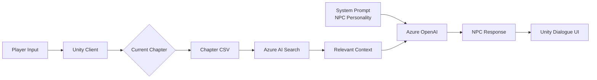
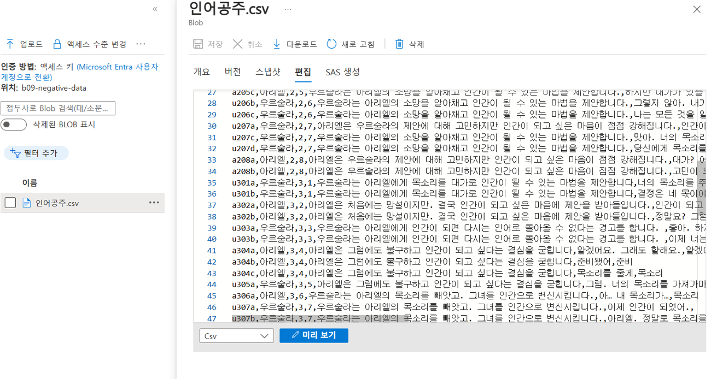
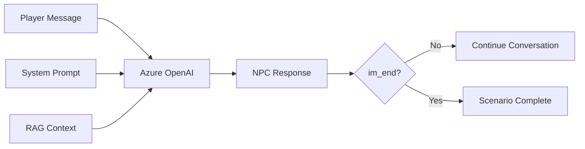
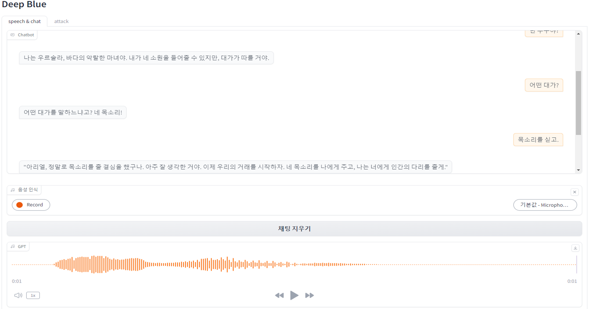
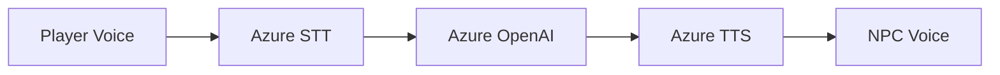
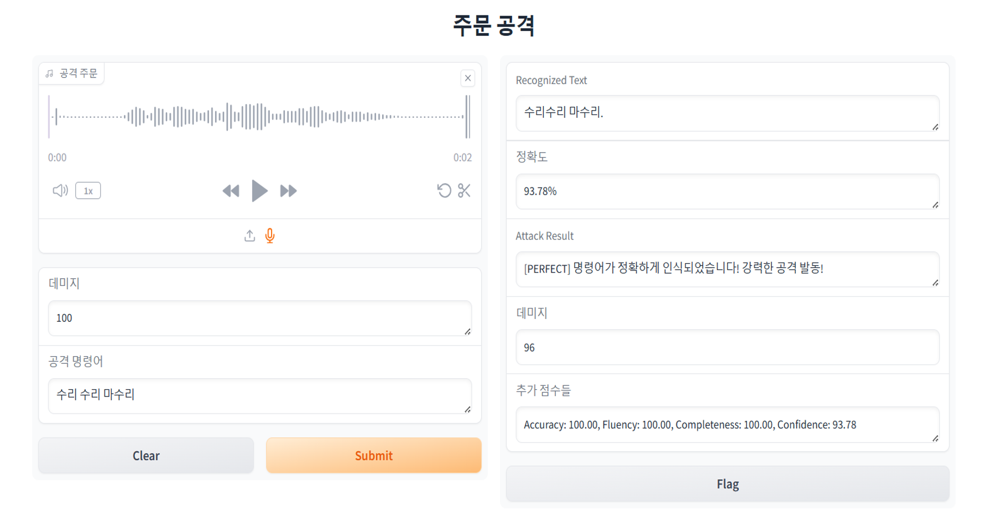
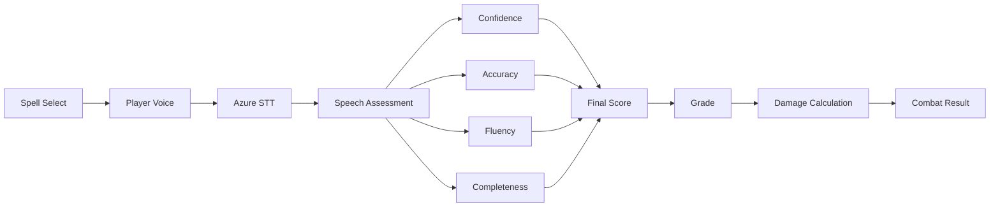
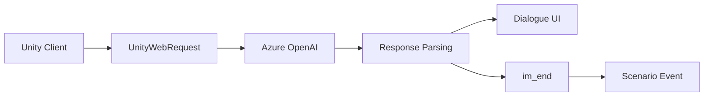
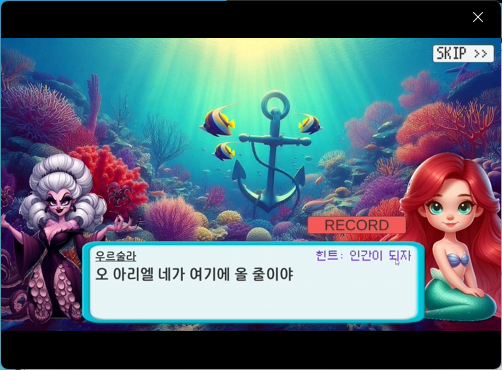
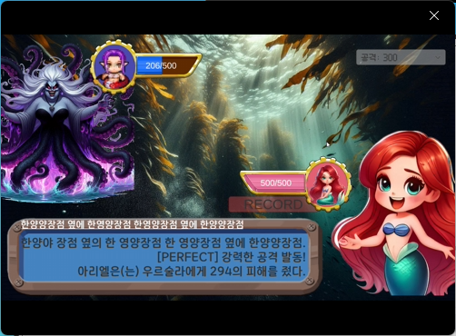

# LLM-NPC-RPG

LLM, RAG, STT/TTS를 활용하여 플레이어와 자연스럽게 대화하는 NPC를 구현한 Unity 기반 AI RPG 프로젝트입니다.

기존 게임의 정형화된 NPC 대화를 넘어, 플레이어의 질문을 이해하고 게임 세계관을 기반으로 답변하는 인터랙티브 NPC 시스템 구현을 목표로 개발했습니다.

## 🎬 Demo
\-▶ Trailer (https://youtu.be/8T0DTV-vXv0)  
\-▶ Gameplay Highlight (https://youtu.be/B87SKs729xo)  
\-▶ Full Gameplay Playlist (https://www.youtube.com/playlist?list=PLZ9kCtQmPheI)  

# 📑 목차

* [프로젝트 소개](#프로젝트-소개)
* [프로젝트 개요](#프로젝트-개요)
* [기술 스택](#기술-스택)
* [시스템 아키텍처](#시스템-아키텍처)
* [주요 기능](#주요-기능)

  * [1. 시나리오 기반 RAG 시스템](#1-시나리오-기반-rag-시스템)
  * [2. NPC Persona(System Prompt) 설계](#2-npc-personasystem-prompt-설계)
  * [3. 음성 인터랙션(STT/TTS)](#3-음성-인터랙션stttts)

    * [3-1. NPC 음성 대화](#3-1-npc-음성-대화)
    * [3-2. 음성 주문 시스템](#3-2-음성-주문-시스템)
  * [4. Unity AI 연동](#4-unity-ai-연동)
* [기술적 문제 해결](#기술적-문제-해결)

  * [1. LLM이 미래 시나리오를 답변하는 문제](#1-llm이-미래-시나리오를-답변하는-문제)
  * [2. Azure OpenAI 응답 파싱 문제](#2-azure-openai-응답-파싱-문제)
  * [3. 자연어 응답만으로 대화 종료를 판단하기 어려운 문제](#3-자연어-응답만으로-대화-종료를-판단하기-어려운-문제)
* [회고](#회고)

---

## 프로젝트 소개

기존 게임의 NPC는 정해진 대사만 반복하거나 선택지 기반으로 대화를 진행하는 경우가 대부분입니다. 이러한 방식은 플레이어와의 상호작용이 제한적이며, 반복 플레이 시 몰입감이 떨어지는 한계가 있습니다.

본 프로젝트는 LLM(Large Language Model)을 활용하여 플레이어의 자연어 입력을 이해하고, 게임 세계관과 NPC의 역할에 맞는 답변을 생성하는 NPC 대화 시스템을 구현하는 것을 목표로 개발했습니다.

또한 RAG(Retrieval-Augmented Generation)를 적용하여 NPC가 게임 내 설정과 시나리오를 기반으로 일관성 있는 답변을 생성하도록 하였으며, STT(Speech-to-Text)와 TTS(Text-to-Speech)를 연동하여 음성 기반 상호작용까지 지원하는 인터랙티브 RPG 환경을 구현했습니다.

---

## 프로젝트 개요

| 항목      | 내용                                                             |
| ------- | -------------------------------------------------------------- |
| 프로젝트명   | LLM-NPC-RPG                                                    |
| 프로젝트 형태 | Microsoft AI School 팀 프로젝트                                     |
| 개발 기간   | 2024.08.21 ~ 2024.08.29 (9일)                                   |
| 개발 인원   | 5명                                                             |
| 역할      | Team Leader / Unity Client / LLM Integration / RAG / STT · TTS |

### 담당 역할

* 프로젝트 일정 관리 및 개발 방향 조율
* Unity 기반 게임 클라이언트 전체 개발
* Azure OpenAI REST API 연동
* Azure AI Search 기반 RAG 구축
* Azure Speech(STT/TTS) 연동
* NPC 시나리오 및 RAG 데이터 작성
* 프로젝트 발표 및 시연
  
---

## 시스템 아키텍처

Unity Client  
&emsp;&emsp;│  
&emsp;REST API  
&emsp;&emsp;│  
Azure OpenAI  
&emsp;&emsp;│  
&emsp;&emsp;├─ Azure AI Search (RAG)  
&emsp;&emsp;├─ Azure Speech STT  
&emsp;&emsp;└─ Azure Speech TTS  

---

## 기술 스택

| Category              | Technologies                                   |
| --------------------- | ---------------------------------------------- |
| **Game Client**       | Unity, C#                                      |
| **AI Platform**       | Azure OpenAI, Azure AI Search, Azure AI Speech |
| **Prototype & Tools** | Python, Gradio                                 |
| **API Integration**   | REST API (HTTP)                                |
| **Version Control**   | Git, GitHub                                    |

---

## 주요 기능

### 1. 시나리오 기반 RAG 시스템
#### 배경

기존 게임의 NPC는 정해진 대사나 선택지 기반으로만 대화를 진행하기 때문에 플레이어의 다양한 자연어 입력에 대응하기 어렵습니다. 반대로 LLM만 사용할 경우 게임의 세계관과 시나리오를 벗어난 응답을 생성할 수 있습니다.

본 프로젝트는 자유로운 자연어 대화를 지원하면서도 게임의 스토리와 퀘스트 진행 흐름을 유지할 수 있는 NPC 대화 시스템을 목표로 개발했습니다.

#### 설계

LLM은 게임의 현재 진행 상황을 알지 못하기 때문에 전체 시나리오를 검색 대상으로 사용할 경우 아직 진행되지 않은 이벤트나 미래의 스토리를 답변하는 문제가 발생할 수 있었습니다.

이를 해결하기 위해 시나리오를 챕터 단위의 RAG 데이터로 분리하고, 현재 진행 중인 챕터만 검색 대상으로 제한하여 필요한 정보만 LLM에 전달하도록 설계했습니다.

#### 구현

- 챕터별 CSV 데이터를 Azure AI Search Index로 구축
- Azure AI Search 기반 RAG 검색 적용
- NPC별 System Prompt 구성
- 챕터별 CSV 시나리오 관리
- 현재 챕터만 검색 대상으로 제한
- 상황(Context), 대화 예시 및 키워드를 함께 저장하여 검색 Context 구성

#### 흐름도

#### Azure AI Search에 시나리오 데이터 구축


#### RAG 데이터 구조

NPC의 대사와 함께 현재 진행 상황 및 시나리오 진행 순서(Page)를 저장하여,
LLM이 현재 시나리오의 맥락을 이해하고 게임 진행 흐름에 맞는 응답을 생성하도록 설계했습니다.

| 컬럼   | 설명                                 |
| ---- | ---------------------------------- |
| ID   | 대사 식별자                             |
| 등장인물 | 현재 대사를 하는 NPC                      |
| 페이지  | 챕터 내 대화 진행 순서 (예: 2-1 → 2-2 → 2-3) |
| 상황   | 현재 시나리오 진행 상황                      |
| 대사   | 해당 상황에서의 NPC 응답 예시                 |
| 키워드  | 검색 보조 정보                           |

| ID | 등장인물 | 페이지 | 상황 | 대사 | 키워드 |
|----|---------|--------|------|------|---------|
| a201g | 아리엘 | 2-1 | 인간 세계를 동경하는 상황 | 저 인간들은 정말 행복해 보인다. 나도 저렇게 자유롭게 살 수 있다면 얼마나 좋을까… | 자유 |
| u202a | 우르술라 | 2-2 | 우르술라가 아리엘에게 접근 | 아리엘, 인간 세계에 관심이 많구나. | 유혹 |
> 시나리오를 챕터 단위로 분리하여 현재 진행 중인 챕터만 RAG 검색 대상으로 사용함으로써,
> 미래 스토리 노출을 방지하고 게임 진행 흐름을 유지했습니다.

#### 결과

- 자유로운 자연어 입력 지원
- 현재 진행 중인 시나리오에 맞는 응답 생성
- 미래 스토리 노출 방지
- 대화 이력을 별도로 관리하지 않고도 시나리오 기반 대화 유지
  
### 2. NPC Persona(System Prompt) 설계
#### 배경

RAG를 통해 현재 시나리오에 필요한 정보를 제공하더라도,
LLM이 NPC의 성격이나 말투를 일관되게 유지하지 못하면
캐릭터성이 무너지고 게임의 몰입감이 떨어질 수 있습니다.

이를 해결하기 위해 NPC의 역할과 성격, 행동 규칙을 System Prompt에 정의하여,
LLM이 NPC의 입장에서 일관된 캐릭터성을 유지하며 대화하도록 설계했습니다.

#### 설계

NPC는 단순히 정보를 전달하는 것이 아니라 시나리오에 맞는 역할을 수행해야 했습니다.

이를 위해 System Prompt에 다음 정보를 포함했습니다.

- NPC 역할
- 성격 및 말투
- 현재 상황에서의 행동 규칙
- 게임 진행 조건
- 대화 종료 조건

#### 구현

- NPC별 System Prompt 구성
- NPC의 역할, 성격, 말투, 행동 규칙 정의
- RAG Context와 플레이어 입력을 함께 전달
- 특정 조건에서는 `im_end`를 반환하여 게임 이벤트를 제어

#### System Prompt 예시

```text
너는 인어공주 연극을 하는 봇이다.

등장인물 : 우르술라

성격
- 악랄함
- 음모를 꾸밈
- 거짓말쟁이
- 마녀

인덱스 데이터를 기반으로
우르술라의 입장에서 한 문장씩 대답한다.

출처는 표시하지 않는다.

특정 조건이 만족되면
'im_end'를 반환하여 게임 이벤트를 진행한다.
```

#### 흐름도


#### 결과

- NPC의 성격과 말투를 일관되게 유지
- 자유로운 자연어 입력 기반 대화 지원
- 게임 진행 조건을 LLM 응답과 연계
- 특정 키워드 대신 상태 신호(`im_end`)를 통해 시나리오 진행 제어

#### 실제 대화 예시


### 3. 음성 인터랙션(STT/TTS)
### 3-1. NPC 음성 대화
#### 배경

기존의 텍스트 기반 NPC 대화는 몰입감이 떨어지고 입력 과정이 번거로웠습니다.

이를 개선하기 위해 플레이어의 음성을 STT로 텍스트로 변환하고, LLM이 생성한 응답을 다시 TTS를 통해 음성으로 출력하여 실제 NPC와 대화하는 듯한 경험을 제공하고자 했습니다.

#### 설계

플레이어의 음성 입력을 Azure Speech-to-Text로 변환한 뒤, Azure OpenAI에서 응답을 생성하고, 생성된 응답을 Azure Text-to-Speech를 이용하여 NPC 음성으로 출력하도록 설계했습니다.

#### 구현

- Azure Speech-to-Text를 이용한 플레이어 음성 입력
- Azure OpenAI 기반 NPC 응답 생성
- Azure Text-to-Speech를 이용한 NPC 음성 출력
- Unity AudioSource를 이용한 음성 재생

#### 흐름도


#### 결과

- 텍스트 입력 없이 NPC와 음성 대화 가능
- 자연스러운 음성 기반 인터랙션 제공
- 게임 몰입감 향상
 
### 3-2. 음성 주문시스템 
#### 배경

단순히 음성을 텍스트로 변환하는 것만으로는 플레이어의 발음 숙련도를 게임 플레이에 반영하기 어려웠습니다.

이를 해결하기 위해 Azure Speech Assessment의 음성 평가 결과를 활용하여 주문의 성공 여부와 데미지를 결정하는 시스템을 구현했습니다.

#### 설계

Speech Assessment에서 제공하는 Confidence, Accuracy, Fluency, Completeness 점수를 가중치로 계산하여 최종 점수를 산출하고, 해당 점수에 따라 주문의 등급과 데미지를 결정하도록 설계했습니다.

또한 음성 인식 실패(ResultReason) 발생 시 재녹음을 수행하여 잘못된 인식으로 인한 플레이 경험 저하를 방지했습니다.

#### 구현

- Azure Speech Assessment 기반 음성 평가
- Confidence, Accuracy, Fluency, Completeness 점수 수집
- 가중치를 적용한 최종 점수 계산
- ResultReason을 통한 음성 인식 실패 확인
- 인식 실패 시 재녹음 수행
- 최종 점수에 따른 주문 등급 및 데미지 계산

##### 음성 평가 가중치
| 평가 요소        |                                                                                 비율 |
| ------------ | ---------------------------------------------------------------------------------: |
| Confidence   |                                                                                50% |
| Accuracy     |                                                                                30% |
| Fluency      |                                                                                10% |
| Completeness |                                                                                10% |
| **최종 점수 계산** | **(Confidence × 0.5) + (Accuracy × 0.3) + (Fluency × 0.1) + (Completeness × 0.1)** |

##### 주문 등급
| Final Score | Grade     |
| ----------: | --------- |
|        ≥ 90 | PERFECT   |
|        ≥ 75 | EXCELLENT |
|        ≥ 50 | GREAT     |
|        ≥ 35 | GOOD      |
|        < 35 | MISS      |

##### Speech Assessment 결과


#### 흐름도


#### 결과

- 음성 입력을 전투 시스템과 연동
- 발음 정확도에 따른 스킬 성능 차등 적용
- 음성 평가 결과를 게임 플레이에 활용
- 재녹음을 통해 음성 인식 실패 상황 개선

### 4. Unity AI 연동
#### 배경

AI 기능은 단순히 외부 서비스를 호출하는 것이 아니라 게임 플레이의 일부로 자연스럽게 동작해야 했습니다.

이를 위해 Unity에서 Azure OpenAI와 Azure Speech를 연동하고, 대화·음성 인터랙션·시나리오 진행이 하나의 게임 시스템으로 동작하도록 구현했습니다.

#### 설계

각 AI 서비스의 특성에 맞는 연동 방식을 적용했습니다.

- LLM은 REST API를 통해 Azure OpenAI와 통신
- STT/TTS는 Azure Speech SDK(Cognitive Services)를 사용
- AI 응답은 Unity의 UI 및 게임 이벤트와 연동

#### 구현

- UnityWebRequest 기반 Azure OpenAI REST API 연동
- Azure Speech SDK(Cognitive Services)를 이용한 STT/TTS 구현
- 음성 데이터를 Audio 파일로 변환하여 STT 요청
- TTS 결과를 AudioClip으로 변환하여 Unity에서 재생
- GPT 요청은 JsonUtility를 이용하여 Request Body 생성
- GPT 응답은 필요한 `content`만 추출하여 게임에 맞게 후처리

##### GPT 응답 후처리

Azure OpenAI의 응답에는 대화 내용 외에도 메타데이터가 함께 포함되어 있었습니다.

게임에서는 NPC의 대사만 필요했기 때문에 `content` 영역만 추출하여 사용했으며,
응답에 포함될 수 있는 특수문자와 게임 제어용 문자열(`im_end`)은 별도로 제거하여 Dialogue UI에 출력하도록 구현했습니다.

##### AI 서비스별 연동 방식
| 기능                    | 연동 방식                                 |
| --------------------- | ------------------------------------- |
| Azure OpenAI          | UnityWebRequest (REST API)            |
| Azure Speech(STT/TTS) | Azure Speech SDK (Cognitive Services) |
| Request               | JsonUtility                           |
| Response              | Response Parser (content 추출)         |

#### 흐름도

#### Unity 대화


#### Unity 전투


#### 결과

- Azure OpenAI와 Azure Speech를 Unity 게임에 통합
- 서비스 특성에 맞는 API 및 SDK 적용
- 음성 데이터를 Unity에서 직접 활용 가능한 형태로 변환
- GPT 응답에서 필요한 대사만 추출하여 UI에 출력
- 게임 제어용 문자열(`im_end`)을 활용하여 시나리오와 AI 응답을 연계

---

## 기술적 문제 해결

### 1. LLM이 미래 시나리오를 답변하는 문제

#### 문제

초기에는 전체 시나리오를 하나의 RAG 데이터로 구성하여 검색했습니다.
하지만 현재 진행 상황과 관계없이 아직 발생하지 않은 이벤트나 미래의 스토리를 함께 검색하는 문제가 발생했습니다.

#### 원인

LLM은 게임의 진행 상태를 직접 알지 못하기 때문에,
검색된 Context 안에 미래 시나리오가 포함되면 이를 현재 대화의 정보로 인식하여 응답을 생성했습니다.

#### 해결

시나리오를 챕터 단위의 CSV로 분리하고,
현재 진행 중인 챕터만 Azure AI Search의 검색 대상으로 제한했습니다.

이를 통해 현재 진행에 필요한 Context만 LLM에 전달하도록 변경했습니다.

#### 결과

- 미래 스토리 노출 방지
- 현재 시나리오에 맞는 자연스러운 응답 생성
- 게임 진행 흐름 유지

### 2. Azure OpenAI 응답 파싱 문제

#### 문제

Azure OpenAI의 응답은 `choices`, `message`, `content` 등 여러 계층으로 구성된 JSON 형태였습니다.

게임에서는 NPC의 대사(`content`)만 필요했지만, Unity의 `JsonUtility`만으로는 원하는 데이터만 선택적으로 추출하기 어려웠습니다.

#### 원인

`JsonUtility`는 객체 전체를 직렬화/역직렬화하는 방식에 적합하지만,

게임에서는 응답 전체가 아닌 `content` 영역만 필요했으며, 응답에 포함된 메타데이터와 게임 제어 문자열(`im_end`)도 함께 제거해야 했습니다.

#### 해결

요청(Request)은 `JsonUtility`를 이용하여 Request Body를 생성하고,

응답(Response)은 `content`와 `end_turn` 문자열의 위치를 탐색하여 필요한 구간만 추출하는 Custom Parser를 구현했습니다.

추출된 문자열은 특수문자와 게임 이벤트 제어 문자열(`im_end`)을 제거한 후 Dialogue UI에 출력하도록 처리했습니다.

#### 결과

- 필요한 NPC 대사만 빠르게 추출
- Dialogue UI에서 바로 사용할 수 있는 데이터 생성
- 게임 이벤트 제어와 화면 출력 로직 분리
- Azure OpenAI 응답을 게임에 맞게 후처리

### 3. 자연어 응답만으로 대화 종료를 판단하기 어려운 문제

#### 문제

LLM은 동일한 의미라도 다양한 표현으로 응답을 생성하기 때문에,
Unity에서 대화가 종료되었는지를 자연어만으로 안정적으로 판단하기 어려웠습니다.

#### 원인

대화 종료를 특정 문장이나 키워드로 판별할 경우,
응답 표현이 조금만 달라져도 종료 여부를 정확하게 판단하지 못하는 문제가 발생했습니다.

#### 해결

NPC의 System Prompt에 대화 종료 조건을 정의하고,
조건이 만족되면 `im_end`를 함께 출력하도록 설계했습니다.

Unity에서는 응답을 후처리하는 과정에서 `im_end`의 포함 여부를 확인하여 대화 종료를 판단하고,
Dialogue UI에는 `im_end`를 제거한 NPC의 대사만 출력하도록 구현했습니다.

#### 결과

- 자연어 표현과 관계없이 대화 종료를 안정적으로 판단
- UI 출력과 대화 종료 로직 분리
- 시나리오 진행을 일관되게 유지
  
---

## 회고

### 프로젝트를 통해 배운 점

이번 프로젝트는 LLM, RAG, STT/TTS와 같은 AI 기술을 Unity 게임에 적용하며, 단순한 기능 구현을 넘어 게임 시스템 안에서 안정적으로 동작하도록 설계하는 과정을 경험할 수 있었습니다.

특히 RAG를 활용하여 현재 시나리오에 맞는 정보를 제공하고, System Prompt를 통해 NPC의 역할과 성격을 유지했으며, Unity와 Azure AI 서비스를 연동하여 음성 기반 NPC 대화와 주문 시스템을 구현했습니다.

또한 AI 모델의 응답을 그대로 사용하는 것이 아니라, 게임의 진행 흐름과 UI, 이벤트 시스템에 맞게 제어하고 후처리하는 과정이 AI 게임 개발에서 중요하다는 점을 배울 수 있었습니다.

### 아쉬웠던 점

초기에는 여러 NPC와 동시에 대화할 수 있는 **N:1 대화 시스템**을 구현하는 것을 목표로 했습니다.

하지만 약 10일이라는 제한된 개발 기간 안에서 안정적인 게임 플레이를 구현하는 것이 우선이라고 판단하여, 플레이어와 NPC 간의 **1:1 대화 시스템**으로 범위를 조정했습니다.

또한 플레이 로그를 기반으로 RAG 데이터를 지속적으로 보완하고 응답 품질을 개선하는 기능도 계획했지만, 프로젝트 일정상 구현하지 못한 점이 아쉬움으로 남았습니다.

### 앞으로 개선하고 싶은 점

향후에는 대화 이력을 활용하여 이전 대화를 기억하는 NPC를 구현하고, 여러 NPC가 하나의 상황을 공유하며 플레이어와 상호작용하는 **Multi-Agent 기반 NPC 시스템**으로 확장해 보고 싶습니다.

또한 플레이 로그를 활용한 RAG 데이터 개선과 NPC 행동 AI를 결합하여, 정해진 시나리오를 넘어 게임 상황에 능동적으로 반응하는 AI NPC를 구현하는 것을 목표로 하고 있습니다.

이번 프로젝트를 통해 AI 모델을 단순히 연동하는 것보다, **게임 시스템 안에서 안정적으로 동작하도록 설계하고 제어하는 과정이 더욱 중요하다는 점**을 배울 수 있었습니다. 앞으로도 AI 기술을 게임 플레이와 자연스럽게 연결하는 개발을 지속적으로 연구하고 발전시켜 나가고자 합니다.

---

## Contact
- Email : 1abcm1@naver.com
- GitHub: https://github.com/JK-remi
